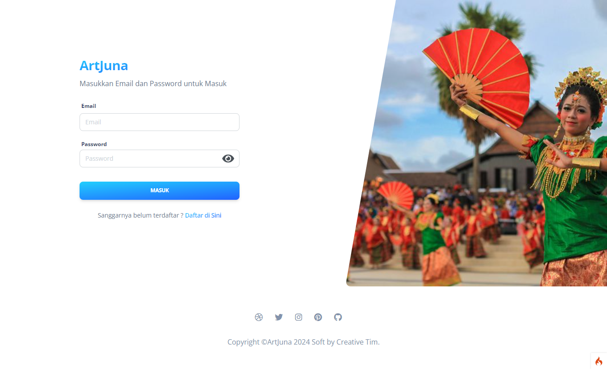
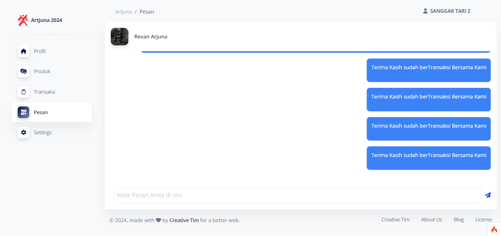

# Artjuna Admin

## Apa itu Artjuna Admin

Artjuna admin adalah website yang dibangun untuk digunakan admin Artjuna untuk mengelola user dan admin dari sanggar untuk mengelola profil sanggar, produk transaksi dan berkomunikasi dengan pelanggannya.

### Fitur Admin Artjuna

* Mengelola User Sanggar
* Mengelola User Pelanggan
* Mengelola publish budaya
* Setting Akun

### Fitur Admin Sanggar

* Mengelola Profil Sanggar
* Mengelola Produk Sanggar
* Mengelola Kontrak Pelanggan
* Pesan

## ScreenShoots

### Admin Artjuna

|  |  |  |  |  |
|------------------------|------------------------------------------------|----------------------------------------|-----------------------------------------|-----------------------------------------|
| Login                  | Tampilan Beranda Admin Artjuna                 | Halaman Sanggar                        | Halaman Pengguna                        | Halaman Setting Admin                   |

### Admin Sanggar

|  |  |  |  |  |  |
|-------------------------------------|---------------------------------------|------------------------------------------|----------------------------------------|-------------------------------|-------------------------------------------|
| Tampilan Beranda Profil Sanggar     | Halaman Produk                        | Halaman Transaksi                        | Halaman Daftar Pesan                   | Halaman Pesan                 | Halaman Setting Sanggar                   |

## Technology

* Programming Leanguage
  * PHP
  * HTML
  * JavaScript
  * CSS

* Framework
  * Codeignitier
  * TailwindCss
  * AlpineJS

## Setup

1. Configure .env
   Pertama configure env terlebih dahulu dari baseURL dan Database yang kamu gunakan.
  
2. Migration
   Selanjutnya migrasikan database buat semua table dan data dummy yang di perlukan. kamu bisa menggunakan perintah ini :
      ```PowerShell
      # Perintah untuk Migration
      php spark migrate
      ```
3. Membuat Data Dummy
   Selanjutnya Membuat data awal agar sistem bisa berfungsi.
    ```PowerShell
    # Perintah untuk Seeder
    php spark db:seed TestSeeder
    ```
4. Jalankan
   Untuk menjalankan anda bisa menggunakan perintah ini.
   ```PowerShell
    # Perintah untuk Seeder
    php spark serve
    ```
6. Selesai
   Jika semua sudah di konfigrasi dengan baik selnjutnya silahkan di rubah sesuai kebutuhan anda.

## Server Requirements

PHP version 8.1 or higher is required, with the following extensions installed:

- [intl](http://php.net/manual/en/intl.requirements.php)
- [mbstring](http://php.net/manual/en/mbstring.installation.php)

Additionally, make sure that the following extensions are enabled in your PHP:

- json (enabled by default - don't turn it off)
- [mysqlnd](http://php.net/manual/en/mysqlnd.install.php) if you plan to use MySQL
- [libcurl](http://php.net/manual/en/curl.requirements.php) if you plan to use the HTTP\CURLRequest library

## Contribution

Jika Anda ingin berkontribusi pada proyek ini, harap ikuti langkah-langkah di bawah ini:

1. Silakan fork repositori ini dan buat branch baru untuk fitur atau perbaikan yang Anda rencanakan.
2. Lakukan perubahan yang diperlukan.
3. Kirimkan pull request ke branch utama kami untuk ditinjau.
4. Pastikan kode Anda memenuhi pedoman kode kami.

## Lisensi

- Copyright © 2024 Fade28.
- **Sistem Informasi Akademik Sekolah is open-sourced software licensed under the [MIT license](LICENSE).**

## Created By

Proyek ini saya bangun berdua bersama partner saya dan di publish sebagai bentuk portofolio yang dapat di pertanggung jawabkan.
 1. Ahmad Fatih Fadhlillah
 2. Revan Arjuna Menda

## Contact

Jika anda tertarik diskusi lebih lanjut atau membangun kerjasama terkait dengan saya dapat menghubungi link dibawah ini :
- Facebook : <a href="https://www.facebook.com/fatihbro/">Ahmad Fati Fadhlillah</a>
- LinkedIn : <a href="https://www.linkedin.com/in/fatih-fadhlillah-876654241">Fade 28</a>
